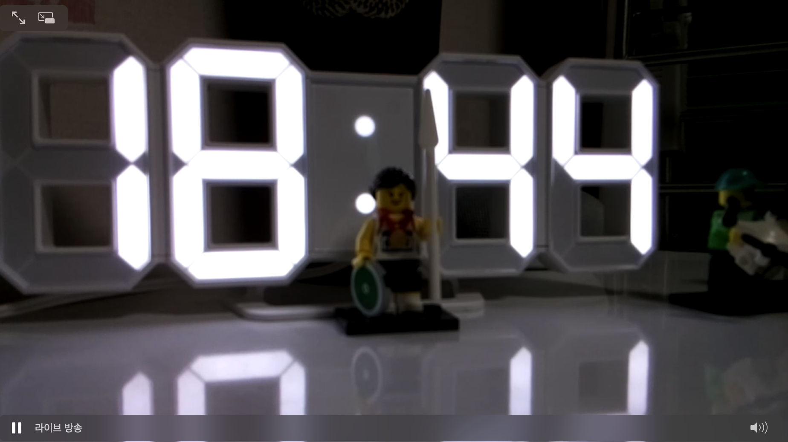
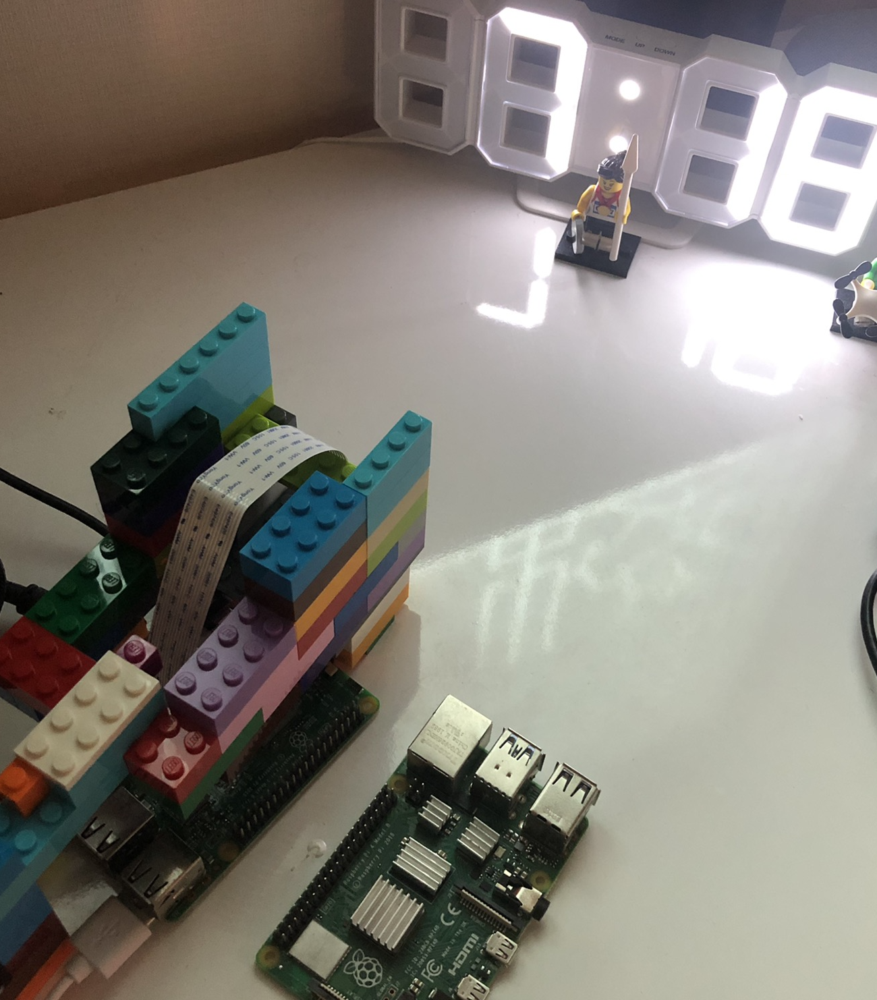
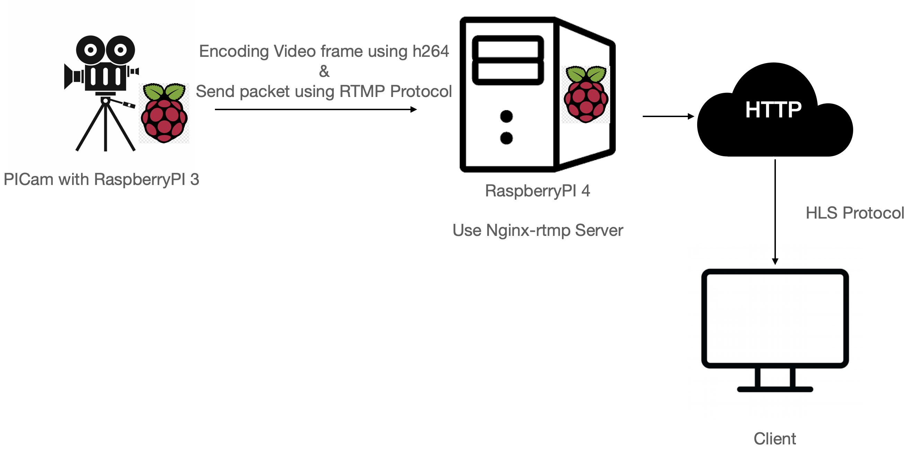

# How to build LiveStreaming
This repository is consist of many kind of liveStreaming projects 

## RaspberryPI + Nginx_RTMP + PICam
Making HLS or RTMP LiveStreaming using RaspberryPI, PICam and Nginx_RTMP Server 

### RaspberryPI + Nginx_RTMP + PICam Live Streaming Project Structure
