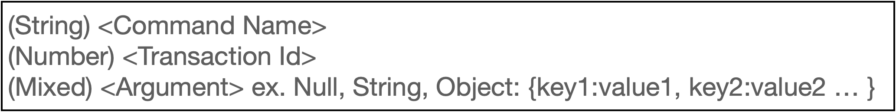

# RTMP Spec
Describe RTMP(Real-Time Message Protocol) Spec

## RTMP Packet Header
기본 RTMP Packet header의 값은 12bytes 이나 Basic Header의 값을 1, 2 byte 정도 늘릴 수 있다.
 

 
첫 fmt와 stream id는 기본 header(basic header), 그 후 stream id(cont) 2 byte는 늘리고 싶을때 늘릴 수 있는 사이즈(extended basic header).

## RTMP Packet Example
 

- Header의 첫 1byte
  - **0x03** = 00000011, 첫 2 bits는 fmt 나머지 6 bits는 stream id
- Header이후 Packet의 첫 1byte(**0x02**) string size를 나타낼 예약어. 0x02 이후 2 bytes가 따라올 String 사이즈를 나타낸다
- createStream string 이후 **0x00**은 transaction id
- 마지막 **0x05**는 더 이상 내용이 없다는 의미(null, there are no arguments)
### fmt
- **00**: 12 bytes size header(full size header)
- **01**: 8 bytes size header, not including message stream id
- **10**: 4 bytes size header, Only basic header and timestamp included
- **11**: 1 byte size header, Only basic header included

### type id
- **0x14**, **0x11**: Indicate an AMFO(Action Message Format) encoded command message, Invoke Message Structure
- **0x08**: Indicate an Audio Packet
- **0x09**: Indicate an Video Packet
- **0x04**: Control Message Structure
- **0x05**, 0x06: Server BW/ Client BW Message structure
- **0x01**: Set Chunk Size

## Invoke Message Structure(type id = 0x14, 0x11)
**0x14**=AMFO, **0x11**=AMF3

## Control Message Structure(type id = 0x04)

## Server BW/Client BW(type id = 0x01)

## Reference
Wikipedia: [RTMP Wiki](https://en.wikipedia.org/wiki/Real-Time_Messaging_Protocol)